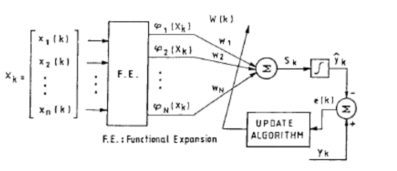
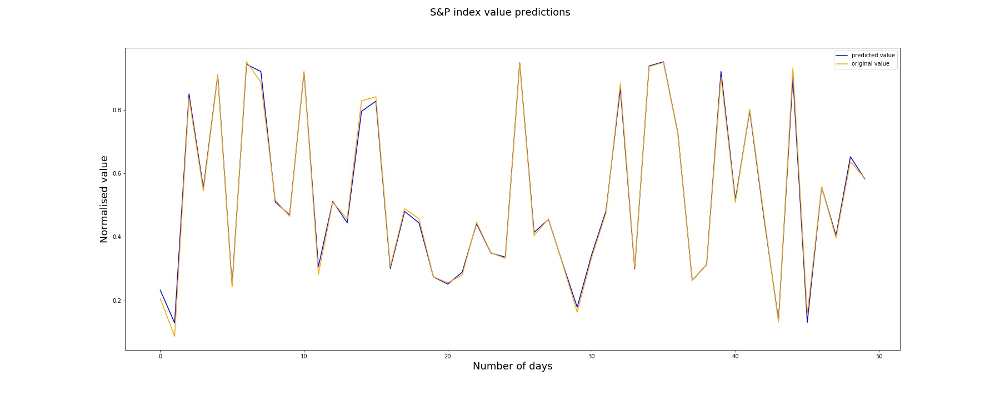

<h1>Predicting value of S&P 500 stock market index on a given day </h1>

<h2> What is S&P 500 stock market index? </h2>

The S&P 500 stock market index, maintained by S&P Dow Jones Indices, comprises 505 common stocks issued by 500 large-cap companies and traded on American stock exchanges, and covers about 80 percent of the American equity market by capitalization. The index is weighted by free-float market capitalization, so more valuable companies account for relatively more of the index. The index constituents and the constituent weights are updated regularly using rules published by S&P Dow Jones Indices. Although the index is called the S&P "500", the index contains 505 stocks because it includes two share classes of stock from 5 of its component companies.
More details can be found [here.](https://en.wikipedia.org/wiki/List_of_S%26P_500_companies)


<h2>Problem Statement:</h2>

We have to predict the value of S&P index on a given.


<h2> Dataset:</h2>

The dataset used here used contains S&P index values for 4165 continuous days hence containing 4165 entries.


<h2>Approach:</h2>
The approach is to use modified Functional Link Artificial Neural Network (FLANN). It is modified in the sense that instead of one neuron at the last layer, a fully connected layer is used.FLANN is a good choice when there is a need to account for temporal context or time series predictions.

<h3>Functional Link Artificial Neural Network (FLANN):</h3>

FLANN is a novel single-layer ANN structure capable of forming arbitrarily complex decision regions by generating nonlinear decision boundaries.Each input value is nonlinearly mapped using functions like trigonometric, power series, chebyschev, exponential, polynomial expansions.



Inputs are are mapped using sin, cosine and square function.The fully connceted layers used has three layers all with sigmoid activation function.The first layer has number of neuron equal to number of features. The second and third layer has 7 and 1 neurons repectively.


<h2> Results: </h2>

The network performed well on both train and test set. The Mean Square Error was as low as 0.00014472.

The following plot shows predicted and original values of the S&P 500 stock market index.




```python

```
